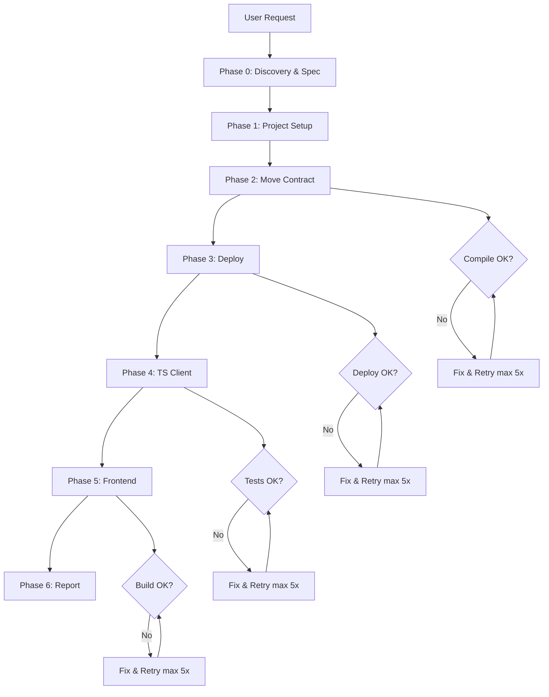

# LumioVibe - Quick Setup Guide

## What is LumioVibe?

LumioVibe is a specialized AI agent that creates complete Move smart contract applications on Lumio Network:
- ✅ Move contract compiled and deployed to testnet
- ✅ TypeScript client library with tests
- ✅ React frontend with wallet integration
- ✅ Everything running and ready to use

## System Architecture

### 1. Runtime Environment

**Docker Image:** `ghcr.io/openhands/runtime:oh_v0.62.0_jz7m8x3p9mfvzfhm_99c3kjtvh8d1c2ro`

Pre-installed tools:
- Lumio CLI v7.8.0 (`/openhands/bin/lumio`)
- Node.js v22.21.1
- pnpm v10.25.0
- TypeScript v5.9.3 (global)
- Vite v7.2.7 (global)
- Vitest v4.0.15 (global)

### 2. System Prompts

**Location:** `openhands/agenthub/codeact_agent/prompts/additional_info.j2`

Added `<LUMIO_VIBE_RUNTIME>` section that informs agents:
- All tools are pre-installed
- Templates location: `/openhands/templates/`
- Lumio testnet configuration
- Important: Use `lumio_coin` and `lumio_account` (NOT aptos equivalents)

### 3. Microagents

**Location:** `.openhands/microagents/`

Main microagent: `lumiovibe.md`
- Triggered by keywords: contract, move, smart contract, dapp, deploy, blockchain, lumio
- Defines mandatory 6-phase workflow
- Includes error recovery rules
- Emphasizes: all tools pre-installed, use templates, don't give up on errors

Supporting microagents:
- `lumio-cli.md` - CLI commands reference
- `move-syntax.md` - Move language guide
- `ts-client.md` - TypeScript client patterns
- `frontend-template.md` - React app structure

### 4. Project Templates

**Location:** `/openhands/templates/`

Structure:
```
templates/
├── move/                   # Move contract templates
│   ├── Move.toml.template
│   └── sources/
├── client/                 # TypeScript client
│   ├── package.json
│   ├── tsconfig.json
│   └── src/
├── frontend/               # React app
│   ├── package.json
│   ├── vite.config.ts
│   ├── tailwind.config.js
│   └── src/
└── scaffold.sh            # Project scaffolding script
```

## Agent Workflow



## Configuration Changes Summary

### Modified Files

1. **`openhands/runtime/utils/runtime_templates/Dockerfile.j2`**
   - Added `/openhands/bin` to PATH in `.bashrc`
   - Added `/openhands/bin` to PATH in `.profile` for login shells
   - Moved LumioVibe dependencies installation outside Ubuntu-only condition

2. **`openhands/runtime/builder/docker.py`**
   - Removed `--no-cache` flag for faster rebuilds

3. **`openhands/agenthub/codeact_agent/prompts/additional_info.j2`**
   - Added `<LUMIO_VIBE_RUNTIME>` section with pre-installed tools info
   - Lumio network configuration
   - Important reminders about not installing tools

4. **`.openhands/microagents/lumiovibe.md`**
   - Complete workflow guide
   - Pre-installed tools emphasis
   - 6-phase mandatory workflow
   - Error recovery rules

## Testing the Setup

### 1. Verify Runtime Image

```bash
docker run --rm --user openhands \
  ghcr.io/openhands/runtime:oh_v0.62.0_jz7m8x3p9mfvzfhm_99c3kjtvh8d1c2ro \
  /bin/bash -lc "lumio --version && node --version && pnpm --version && tsc --version"
```

Expected output:
```
lumio 7.8.0
v22.21.1
10.25.0
Version 5.9.3
```

### 2. Verify Templates

```bash
docker run --rm --user openhands \
  ghcr.io/openhands/runtime:oh_v0.62.0_jz7m8x3p9mfvzfhm_99c3kjtvh8d1c2ro \
  ls -la /openhands/templates/
```

Should see: `move/`, `client/`, `frontend/`, `scaffold.sh`

### 3. Verify Microagents

```bash
ls -la .openhands/microagents/
```

Should see: `lumiovibe.md`, `lumio-cli.md`, `move-syntax.md`, `ts-client.md`, `frontend-template.md`

## Usage Example

User request:
```
Create a simple counter contract with increment and get_value functions
```

Agent workflow:
1. Asks for project name, confirms requirements
2. Creates `spec.md` and shows to user
3. Scaffolds project structure
4. Writes Move contract with `lumio_coin` module
5. Compiles with `lumio move compile` (retries if errors)
6. Funds account from faucet
7. Deploys with `lumio move publish` (retries if errors)
8. Creates TypeScript client with contract methods
9. Runs tests with `pnpm test`
10. Creates React frontend with Home and Documentation pages
11. Builds with `pnpm build`
12. Starts dev server with `pnpm dev --host`
13. Reports completion with URL

Result: User opens `http://localhost:5173` and sees working dapp!

## Key Success Factors

1. **All tools pre-installed** - Agent doesn't waste time installing
2. **Clear workflow** - 6 mandatory phases with retry logic
3. **Templates ready** - No writing configs from scratch
4. **System prompts** - Agent knows environment setup
5. **Error recovery** - Max 5 retries per phase, never gives up
6. **Complete solution** - Frontend must run, user sees UI

## Troubleshooting

### Agent tries to install lumio
- **Cause:** Agent didn't read LUMIO_VIBE_RUNTIME section
- **Fix:** Microagent should be triggered - check keywords

### Frontend doesn't start
- **Cause:** Build errors not resolved
- **Fix:** Agent should retry build, fix TypeScript errors

### Contract uses aptos_coin
- **Cause:** Agent didn't follow lumiovibe.md
- **Fix:** Emphasize lumio_coin in both system prompt and microagent

## Next Steps (Phase 5)

Browser Integration:
- Auto-open frontend in OpenHands browser
- Show live preview to user
- No need to manually open URL

Status: Not Started
